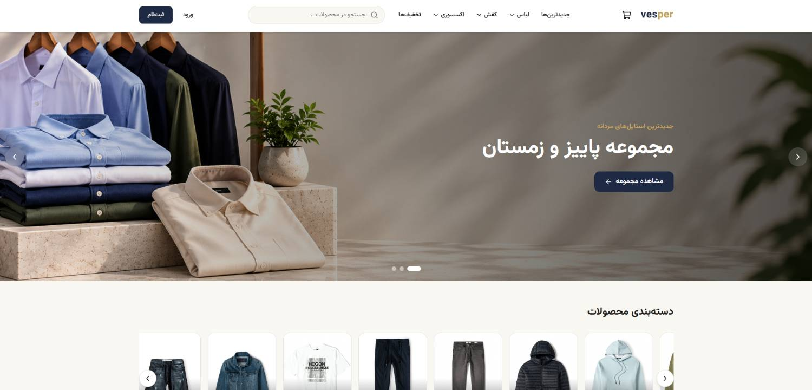
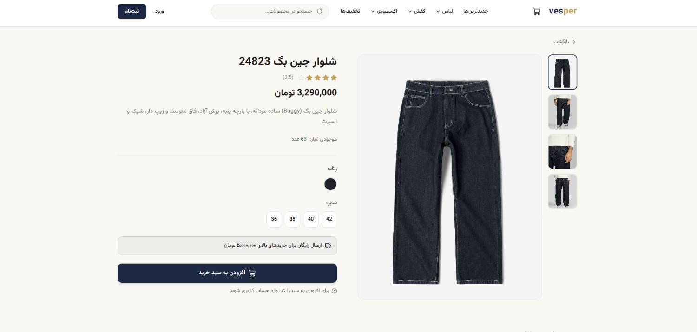
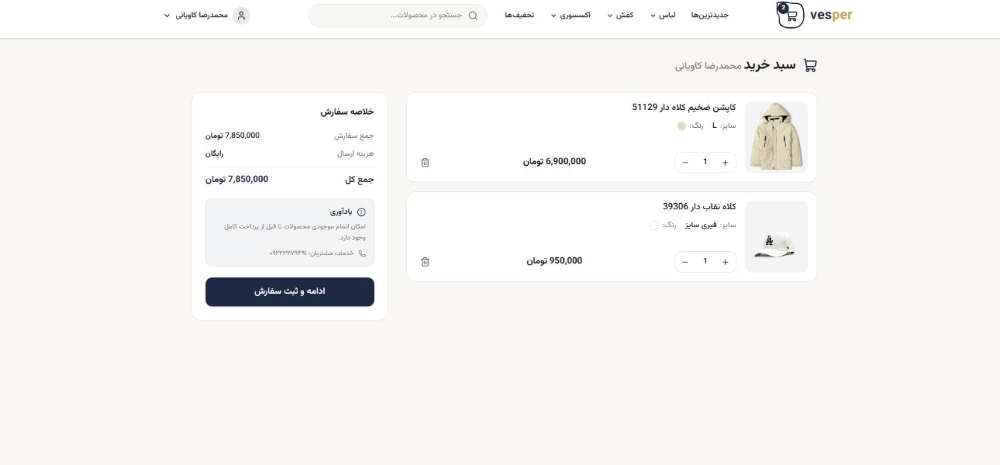
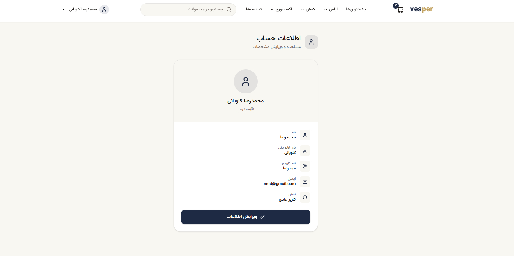
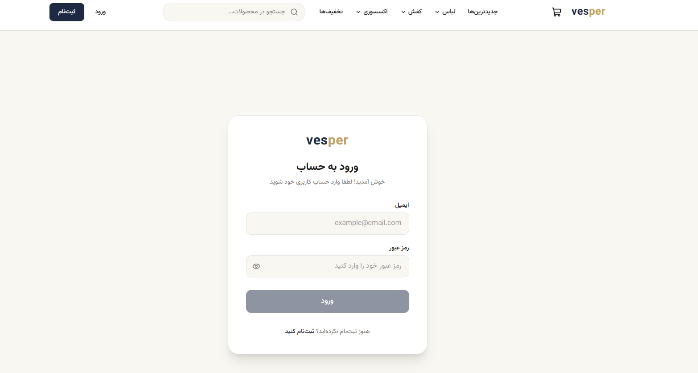
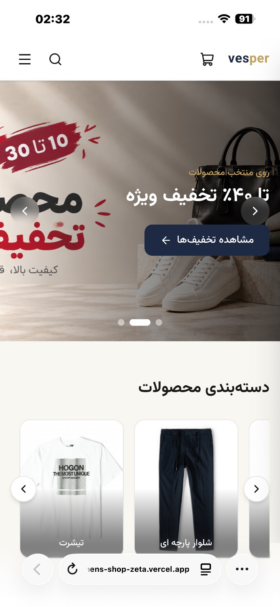

# Vesper — Men's Fashion Store

Modern, responsive e-commerce frontend for men's clothing. Built as a portfolio project with a clean UI, full shopping flow, and authentication.

**Live Demo:** [https://mens-shop-zeta.vercel.app](https://mens-shop-zeta.vercel.app)

---

## Screenshots

> Add your screenshots in a `docs/screenshots/` folder, then these paths will work.

| Home | Product Details |
|:---:|:---:|
|  |  |

| Cart | User Panel |
|:---:|:---:|
|  |  |

| Login | Mobile |
|:---:|:---:|
|  |  |

---

## Features

- **Home** — Hero slider, category carousel, newest products, discount banner & deals
- **Catalog** — Category pages (shirts, hoodies, shoes, accessories…), sort & price filters, pagination / infinite scroll
- **Product details** — Image gallery, zoom on hover, size & color selection, similar products carousel
- **Search** — Live search with suggestions
- **Auth** — Register / login with JWT (`json-server-auth`)
- **Cart** — Add / update / remove items, free shipping over a threshold
- **Checkout** — Address & phone form, stock check, order creation
- **User panel** — Orders history, edit profile
- **UI** — RTL, fully responsive, toast notifications, light theme (Vesper)

---

## Tech Stack

| Layer | Tools |
|--------|--------|
| Frontend | React 19, TypeScript, Vite |
| Styling | Tailwind CSS v4 |
| Routing | React Router DOM |
| Data | TanStack React Query, Axios |
| Forms | React Hook Form |
| UI extras | Lucide React, React Hot Toast, SweetAlert |
| Backend (mock) | JSON Server + JSON Server Auth |

---

## Getting Started

### Prerequisites

- Node.js 18+
- A running API (local `json-server` or deployed backend)

### 1. Clone & install

```bash
git clone https://github.com/Mamziii/mens_shop.git
cd mens_shop
npm install